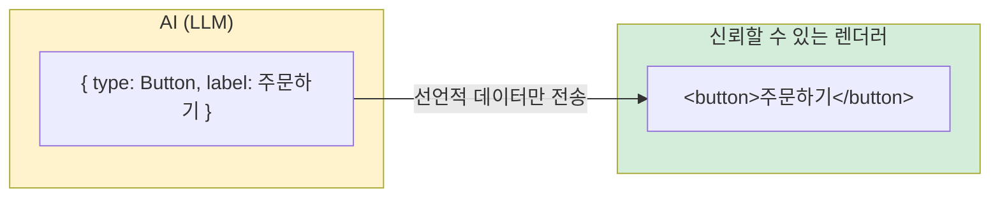
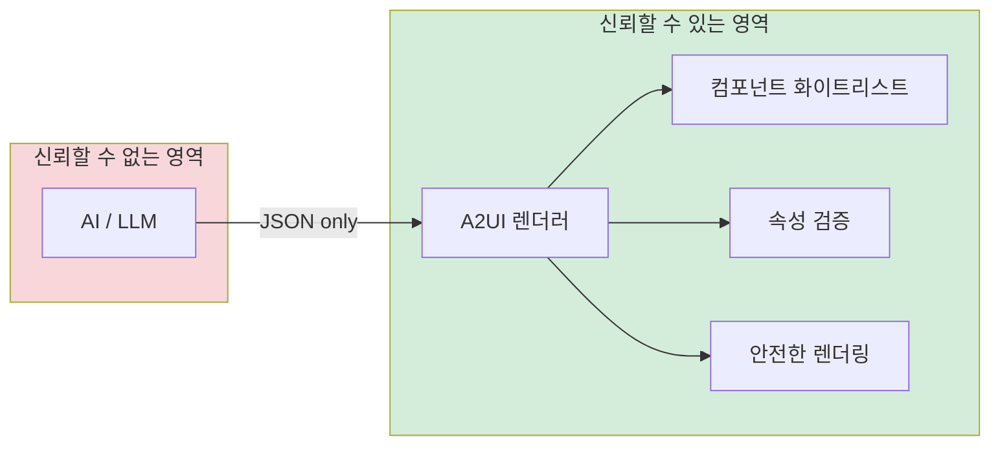
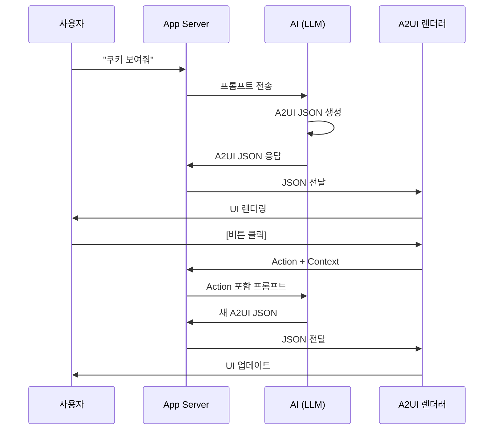
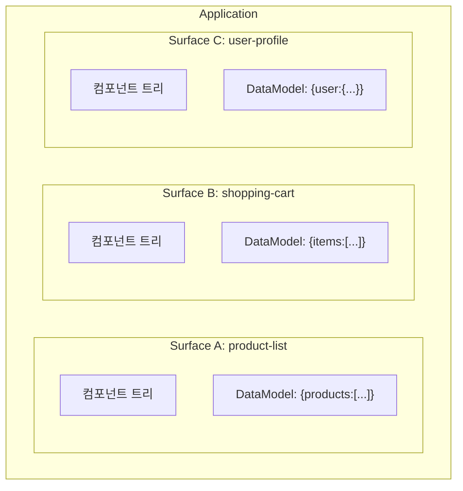
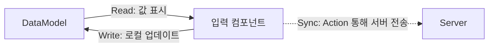
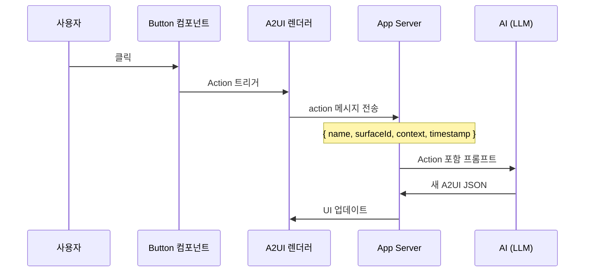
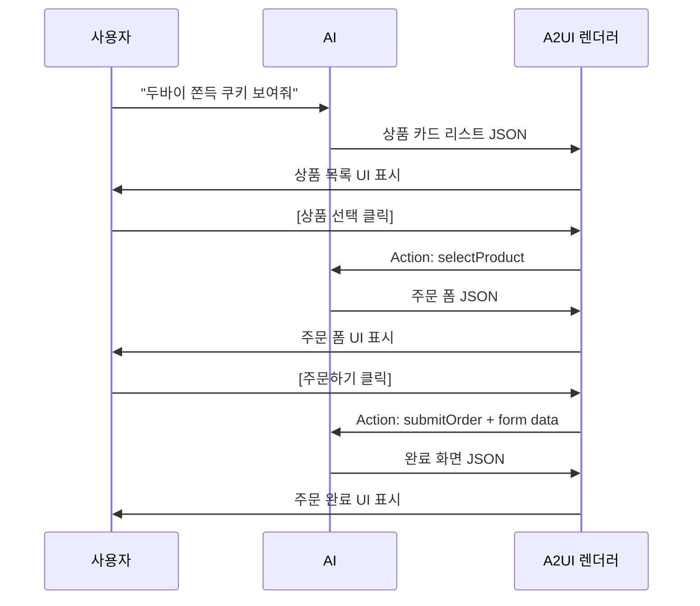

# A2UI 기술 소개 및 MVP 구현 사례

> AI 에이전트가 안전하게 UI를 생성하는 선언적 JSON 프로토콜
>
> 본 문서는 [A2UI v0.9 Specification](https://a2ui.org/specification/v0.9-a2ui/)을 기반으로 작성되었습니다.

---

## 1. A2UI란?

### 개요

**A2UI (Agent-to-UI)**는 Google에서 개발한 오픈 프로토콜로, AI 에이전트가 **선언적 JSON**을 통해 동적으로 UI를 생성하고 제어할 수 있게 합니다.

| 항목 | 내용 |
|------|------|
| 공식 사이트 | [https://a2ui.org/](https://a2ui.org/) |
| GitHub | [https://github.com/google/A2UI](https://github.com/google/A2UI) |
| 현재 버전 | v0.9 |
| 발표 | 2024년 Google I/O |

### 탄생 배경: AI UI의 딜레마

AI 에이전트 시대가 도래하면서 새로운 문제가 등장했습니다:

> **"AI가 텍스트뿐 아니라 풍부한 UI도 생성할 수 있다면 얼마나 좋을까?"**

기존 방식들의 한계:

| 방식 | 설명 | 문제점 |
|------|------|--------|
| 코드 직접 생성 | AI가 HTML/React 코드 생성 | 보안 위험 (XSS, 악성 스크립트) |
| 고정 템플릿 | 미리 정의된 UI 선택 | 유연성 부족, AI 창의성 제한 |
| Function Calling | 함수 호출 후 결과 표시 | UI 표현력 제한, 복잡한 구조 어려움 |

### A2UI의 해결책: 선언적 UI 프로토콜

A2UI는 이 딜레마를 **"선언적 JSON"**으로 해결합니다:



**핵심 아이디어**: AI는 "무엇을 보여줄지"만 선언하고, "어떻게 보여줄지"는 신뢰할 수 있는 렌더러가 담당

---

## 2. A2UI 설계 철학 (v0.9)

### 핵심 원칙

| 원칙 | 설명 |
|------|------|
| **Security First** | 실행 가능한 코드가 아닌 선언적 데이터만 전송 → 악성 코드 실행 원천 차단 |
| **LLM Friendly** | 평탄한 JSON 구조, 깊은 중첩 최소화 → 토큰 효율성, 스트리밍 지원 |
| **Platform Agnostic** | 동일한 JSON → React, Flutter, Swift 등 어디서든 렌더링 |
| **Incremental Updates** | 전체 UI가 아닌 변경된 부분만 업데이트 → 효율적 네트워크 사용 |
| **Bidirectional** | UI ↔ 사용자 입력 ↔ AI 양방향 통신, Action 시스템 내장 |

### 왜 "선언적(Declarative)"인가?

| 구분 | 명령형 (Imperative) | 선언적 (Declarative) |
|------|---------------------|----------------------|
| 방식 | "버튼을 만들어라, 이벤트를 붙여라" | "버튼이 있다. 라벨은 '주문하기'이다" |
| 특징 | 각 단계가 실행 가능한 "명령" | 상태를 "설명"만 함 |
| 보안 | 악성 코드가 숨어들 수 있음 | 실제 생성은 신뢰된 렌더러가 수행 |

---

## 3. A2UI 보안 모델

### 신뢰 경계 (Trust Boundary)



**핵심**: AI가 무엇을 생성하든, 렌더러의 화이트리스트에 있는 컴포넌트만 렌더링됨

### 보안 위협 대응

| 위협 | 상태 | 대응 |
|------|------|------|
| XSS (Cross-Site Scripting) | ✅ 차단 | AI가 `<script>` 태그 생성 불가, 모든 텍스트 이스케이프 |
| 코드 인젝션 | ✅ 차단 | 실행 가능한 코드 전송 불가, JSON 데이터만 허용 |
| 무한 루프/리소스 고갈 | ✅ 렌더러 제어 | 컴포넌트 수/중첩 깊이 제한 가능 |
| 민감 정보 노출 | ⚠️ 앱 레벨 | AI 프롬프트에서 필터링 (A2UI 범위 외) |

---

## 4. A2UI 프로토콜 아키텍처 (v0.9)

### 전체 통신 흐름



### Server-to-Client 메시지 타입 (5가지)

v0.9 스펙에 정의된 서버→클라이언트 메시지:

| 메시지 타입 | 용도 | 필수 필드 |
|-------------|------|-----------|
| `createSurface` | Surface 초기화 | `surfaceId`, `catalogId` |
| `updateComponents` | 컴포넌트 정의/수정 | `surfaceId`, `components` |
| `updateDataModel` | 데이터 모델 설정/수정 | `surfaceId`, `actorId`, `updates`, `versions` |
| `deleteSurface` | Surface 삭제 | `surfaceId` |
| `watchDataModel` | 클라이언트→서버 동기화 설정 | `surfaceId`, 경로별 모드 (`onAction`/`onChanged`) |

### Client-to-Server 메시지 타입 (3가지)

| 메시지 타입 | 용도 | 주요 필드 |
|-------------|------|-----------|
| `action` | 사용자 상호작용 전달 | `name`, `surfaceId`, `sourceComponentId`, `timestamp`, `context` |
| `dataModelChanged` | 데이터 변경 전송 | `surfaceId`, `actorId`, `updates`, `versions` |
| `error` | 클라이언트 오류 보고 | `code`, `surfaceId`, `path`, `message` |

---

## 5. Surface 개념

### Surface란?

**Surface**는 독립적으로 관리되는 UI 영역입니다. 각 Surface는 고유한 ID, 컴포넌트 트리, DataModel을 가집니다.



### Surface 특성

| 특성 | 설명 |
|------|------|
| 고유 ID | 각 Surface는 `surfaceId`로 식별 |
| 독립적 트리 | 독자적인 컴포넌트 트리 보유 |
| 독립적 데이터 | 독자적인 DataModel 보유 |
| 개별 관리 | 생성/업데이트/삭제 개별 처리 |
| Root 컴포넌트 | 반드시 `id: "root"` 컴포넌트 필요 |

---

## 6. 컴포넌트 모델 (v0.9)

### Adjacency List 패턴

v0.9 스펙은 **평탄한 배열**로 트리를 표현합니다 (중첩 대신 ID 참조):

```json
{
  "components": [
    { "id": "root", "component": "Column", "children": ["text1", "text2"] },
    { "id": "text1", "component": "Text", "text": "Hello" },
    { "id": "text2", "component": "Text", "text": "World" }
  ]
}
```

### 컴포넌트 구조

| 필드 | 설명 | 필수 |
|------|------|------|
| `id` | 고유 식별자 | ✅ |
| `component` | 타입 (Text, Button 등) | ✅ |
| `children` | 자식 컴포넌트 ID 배열 | 선택 |
| `weight` | Flex-grow 값 (Row/Column 내) | 선택 |
| 타입별 속성 | `text`, `url`, `action` 등 | 타입별 |

### Adjacency List의 장점

| 장점 | 설명 |
|------|------|
| LLM 친화적 | 깊은 중첩 없이 생성 용이 |
| 개별 업데이트 | 특정 컴포넌트만 수정 가능 |
| 재사용 | ID 참조로 컴포넌트 재사용 |
| 지연 해석 | 순서 무관하게 컴포넌트 정의 |

---

## 7. 데이터 바인딩 시스템 (v0.9)

### Path Resolution

v0.9 스펙은 두 가지 스코프를 정의합니다:

| 스코프 | 경로 형식 | 설명 |
|--------|-----------|------|
| **Root Scope** | `/user/name` (절대 경로) | DataModel 루트에서 해석 |
| **Collection Scope** | `firstName` (상대 경로) | List 템플릿 내 현재 아이템 기준 |

### 문자열 보간 (Interpolation)

`${...}` 구문으로 동적 값 삽입:

| 구문 | 설명 | 예시 |
|------|------|------|
| `${/path}` | 절대 경로 참조 | `${/user/name}` |
| `${path}` | 상대 경로 참조 (컬렉션 내) | `${firstName}` |
| `${func()}` | 클라이언트 함수 호출 | `${formatDate()}` |
| 중첩 | 함수 내 경로 | `${formatDate(${/date}, 'yyyy-MM-dd')}` |

### JSON Pointer 예시

```javascript
// DataModel
{
  user: {
    name: "홍길동",
    addresses: [
      { city: "서울", zip: "12345" }
    ]
  }
}

// JSON Pointer 경로
"/user/name"              → "홍길동"
"/user/addresses/0/city"  → "서울"
```

### 양방향 바인딩 (Two-Way Binding)

입력 컴포넌트(TextField, CheckBox 등)는 양방향 바인딩 지원:



| 동작 | 설명 |
|------|------|
| Read | 컴포넌트가 DataModel 값 표시 |
| Write | 사용자 입력 시 로컬 DataModel 즉시 업데이트 |
| Sync | 서버 업데이트는 명시적 Action으로만 발생 |

---

## 8. 표준 컴포넌트 (v0.9)

### 레이아웃

| 컴포넌트 | 설명 | 주요 속성 |
|----------|------|-----------|
| **Row** | 가로 배치 | `children`, `gap`, `justifyContent`, `alignItems` |
| **Column** | 세로 배치 | `children`, `gap`, `alignItems` |
| **List** | 템플릿 반복 렌더링 | `children.template`, `dataBinding` |
| **Card** | 스타일된 컨테이너 | `title`, `subtitle`, `elevation` |
| **Tabs** | 탭 인터페이스 | `tabs`, `activeTab` |
| **Modal** | 오버레이 다이얼로그 | |

### 표시

| 컴포넌트 | 설명 | 주요 속성 |
|----------|------|-----------|
| **Text** | 텍스트 (마크다운 지원) | `text`, `usageHint` (h1, h2, body 등) |
| **Image** | 이미지 | `url`, `alt`, `width`, `height` |
| **Icon** | 아이콘 | `name`, `size`, `color` |
| **Video** | 비디오 | `url`, `poster`, `autoplay`, `controls` |
| **AudioPlayer** | 오디오 플레이어 | `url`, `controls` |
| **Divider** | 구분선 | `orientation`, `color` |

### 입력

| 컴포넌트 | 설명 | 주요 속성 |
|----------|------|-----------|
| **Button** | 버튼 | `label`, `action`, `disabled` |
| **TextField** | 텍스트 입력 | `label`, `dataBinding`, `placeholder` |
| **CheckBox** | 체크박스 | `label`, `dataBinding` |
| **ChoicePicker** | 선택 (단일/다중) | `options`, `mode` |
| **DateTimeInput** | 날짜/시간 | `mode` (date/time/datetime) |
| **Slider** | 슬라이더 | `min`, `max`, `step` |

---

## 9. Action 시스템 (v0.9)

### Action 메시지 구조

사용자 상호작용은 `action` 메시지로 서버에 전달됩니다:

| 필드 | 설명 |
|------|------|
| `name` | 액션 식별자 (예: "submitOrder") |
| `surfaceId` | 액션이 발생한 Surface |
| `sourceComponentId` | 트리거한 컴포넌트 ID |
| `timestamp` | ISO 8601 타임스탬프 |
| `context` | 액션별 추가 데이터 |

### Action 흐름



### 버튼 Action 정의 예시

```json
{
  "id": "order-btn",
  "component": "Button",
  "label": "주문하기",
  "action": {
    "name": "submitOrder",
    "context": [
      { "key": "productId", "value": { "path": "id" } },
      { "key": "quantity", "value": { "literalNumber": 1 } }
    ]
  }
}
```

---

## 10. MVP 구현 사례: Dubai Market

### 프로젝트 구조

```
dubai-market/
├── app/
│   ├── api/chat/route.ts     # OpenAI API + 시스템 프롬프트
│   ├── page.tsx              # 채팅 UI
│   └── layout.tsx
├── components/a2ui/
│   ├── A2UIRenderer.tsx      # Surface 관리 + 렌더링
│   ├── ComponentRenderer.tsx # 컴포넌트 타입별 디스패치
│   └── catalog/              # 10개 컴포넌트 구현
├── lib/a2ui/
│   ├── types.ts              # TypeScript 타입
│   ├── parser.ts             # JSON 파싱 + 검증
│   ├── interpolation.ts      # 데이터 바인딩
│   └── data-model.ts         # Surface 상태 관리
├── hooks/
│   └── useA2UI.ts            # React 상태 관리
└── data/
    └── products.ts           # 상품 데이터
```

### 핵심 모듈 역할

| 모듈 | 역할 |
|------|------|
| `parser.ts` | AI 응답에서 A2UI JSON 추출, JSONL 파싱, 메시지 검증 |
| `interpolation.ts` | JSON Pointer 해석, 문자열 보간 (`${/path}` → 값) |
| `data-model.ts` | Surface별 DataModel 관리, 상태 업데이트 |
| `A2UIRenderer.tsx` | Surface → React 컴포넌트 변환, Action 처리 |
| `ComponentRenderer.tsx` | 컴포넌트 타입별 디스패치 |

### 구현된 컴포넌트

| 카테고리 | 컴포넌트 |
|----------|----------|
| 레이아웃 | Column, Row, Card, List |
| 표시 | Text, Image, Divider |
| 입력 | Button, TextField, CheckBox |

### 데모: 두바이 쫀득 쿠키 주문 플로우



---

## 11. 시스템 프롬프트 설계

### 효과적인 프롬프트 구성

| 요소 | 설명 |
|------|------|
| JSON Schema | AI가 정확한 구조로 JSON 생성하도록 유도 |
| 컴포넌트 카탈로그 | 사용 가능한 컴포넌트와 속성 명세 |
| UI 템플릿 예시 | 시나리오별 완전한 JSON 예시 |
| 응답 형식 | 텍스트와 JSON 분리 규칙 (구분자 사용) |

### 구분자 기반 응답

```
두바이 쫀득 쿠키 상품 목록입니다!

---a2ui_JSON---
[
  { "type": "createSurface", ... },
  { "type": "updateDataModel", ... },
  { "type": "updateComponents", ... }
]
```

---

## 12. 한계점 및 고려사항

### 현재 한계

| 한계 | 설명 |
|------|------|
| 복잡한 애니메이션 | 표준 컴포넌트에 애니메이션 지원 제한적 |
| 커스텀 스타일링 | 세밀한 CSS 제어 어려움 |
| 렌더러 구현 비용 | 각 플랫폼별 렌더러 개발 필요 |
| LLM 의존성 | AI 응답 품질에 따라 UI 품질 변동 |

### 도입 가이드

| A2UI가 적합한 경우 | A2UI가 부적합한 경우 |
|-------------------|---------------------|
| AI 에이전트가 동적 UI 생성 필요 | 고정된 UI만 필요 (오버엔지니어링) |
| 보안이 중요한 환경 | 매우 복잡한 커스텀 UI 필요 |
| 다중 플랫폼 지원 필요 | 실시간 고성능 필요 (게임 등) |
| 채팅 기반 인터페이스 | |

---

## 13. 참고 자료

### 공식 자료

| 자료 | 링크 |
|------|------|
| A2UI 공식 사이트 | [https://a2ui.org/](https://a2ui.org/) |
| A2UI GitHub | [https://github.com/google/A2UI](https://github.com/google/A2UI) |
| A2UI v0.9 스펙 | [https://a2ui.org/specification/v0.9-a2ui/](https://a2ui.org/specification/v0.9-a2ui/) |

### 관련 표준

| 표준 | 링크 |
|------|------|
| JSON Pointer (RFC 6901) | [https://tools.ietf.org/html/rfc6901](https://tools.ietf.org/html/rfc6901) |
| JSON Schema | [https://json-schema.org/](https://json-schema.org/) |

---

## 부록: MVP 기술 스택

| 영역 | 기술 |
|------|------|
| 프레임워크 | Next.js 16 + React 19 |
| 언어 | TypeScript 5 |
| 스타일링 | Tailwind CSS 4 |
| AI | OpenAI GPT-4o |
| 상태관리 | React useState + Custom Hook |

---

*이 문서는 [A2UI v0.9 Specification](https://a2ui.org/specification/v0.9-a2ui/)을 기반으로 작성되었습니다.*

*Dubai Market MVP 구현 경험 포함 | 작성일: 2025년 1월*
